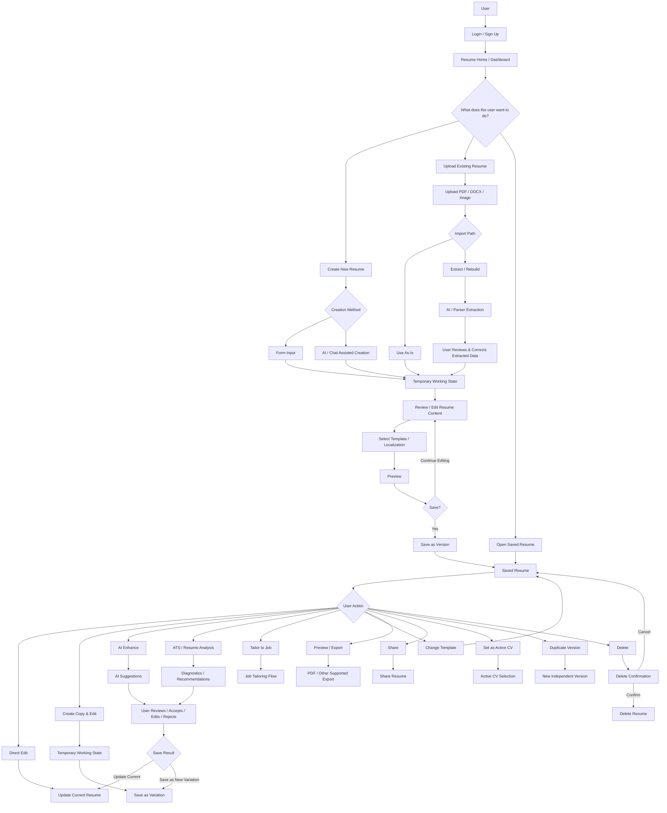
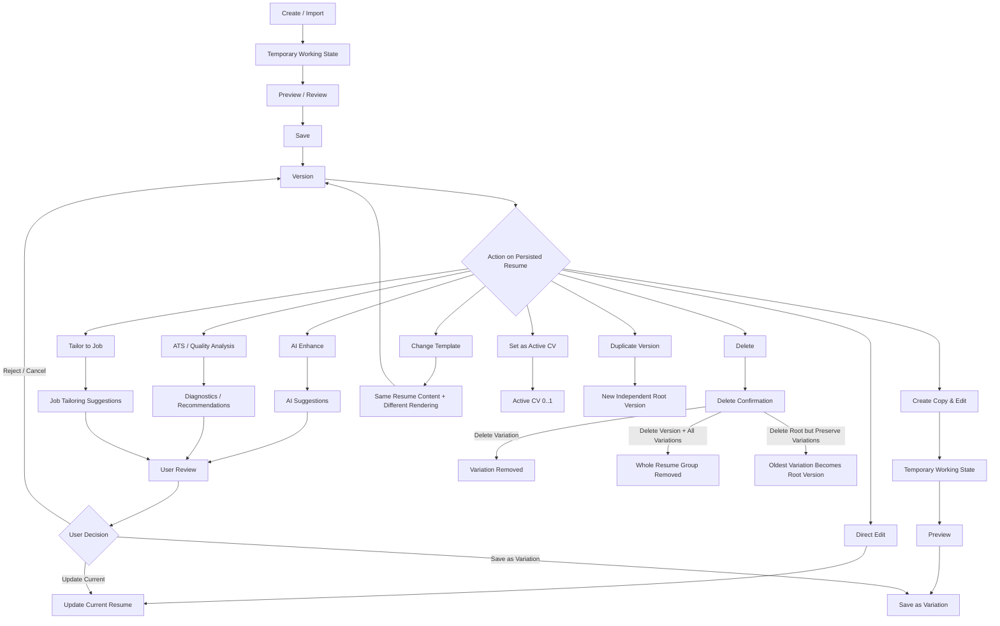
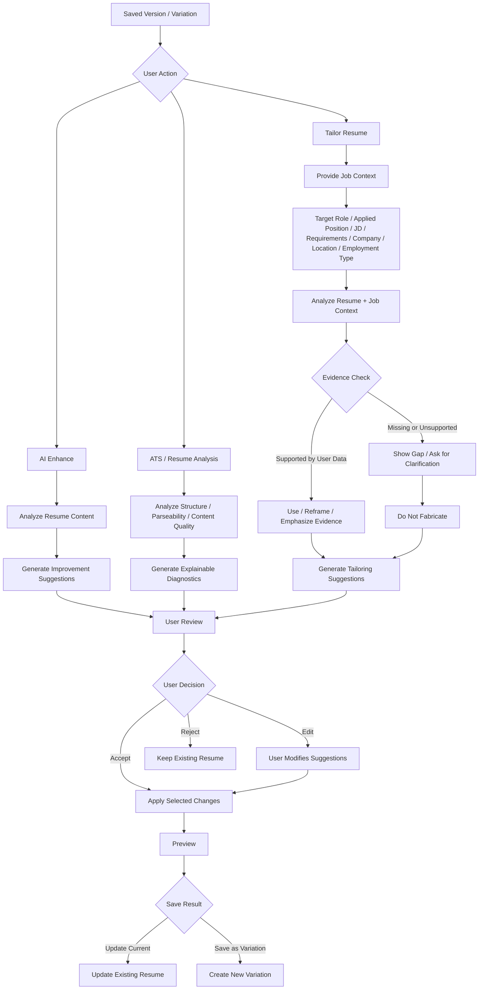
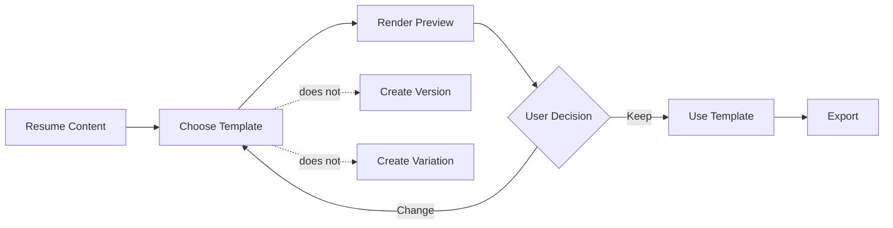
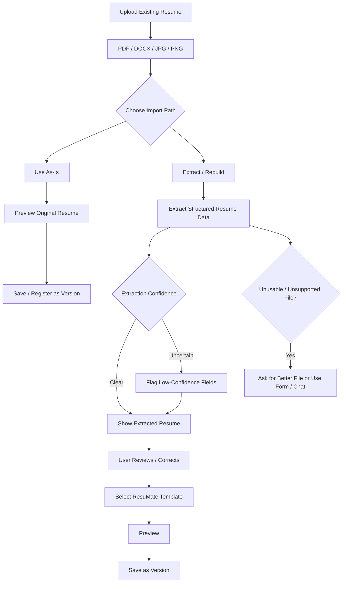
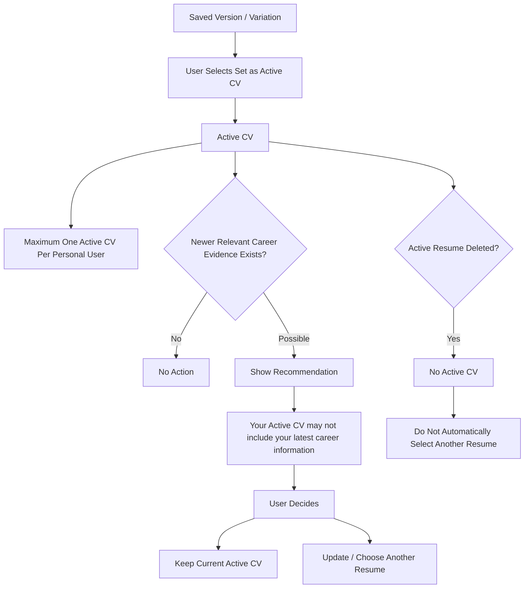
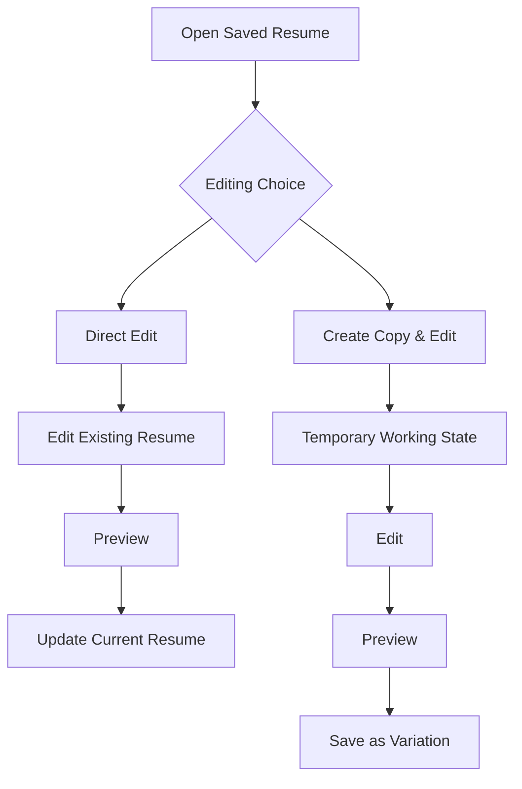
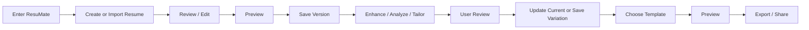

# ResuMate Product Workflow & User Actions — Draft v0.1

> **Purpose:** High-level product workflow for senior review before moving deeper into system/AI architecture.
>
> **Scope:** User-facing workflow and Resume lifecycle only. Technical architecture, database design, services, APIs, and implementation details are intentionally excluded from this draft.

---

## 1. Core Product Idea

ResuMate helps a user create, import, improve, tailor, manage, preview, and export Resume versions while keeping the user in control of factual career information and AI-generated changes.

The user can:

- Create a new Resume from scratch.
- Create a Resume with AI/chat assistance.
- Upload an existing Resume.
- Use an uploaded Resume as-is.
- Extract and rebuild an uploaded Resume into structured ResuMate content.
- Review and correct extracted content before saving.
- Save a Resume as a persistent **Version**.
- Directly edit a saved Resume.
- Create a copy and edit it as a **Variation**.
- Enhance a Resume with AI.
- Analyze Resume quality / ATS-related issues.
- Tailor a Resume for a target role, applied position, job description, or requirements.
- Change Template without creating a new Version or Variation.
- Preview and export the final Resume.
- Share a Resume where supported.
- Set one saved Resume as **Active CV**.
- Duplicate a Version as a new independent root Resume.
- Delete a Resume with confirmation.

---

# 2. Diagram 1 — High-Level Product / User Journey



---

# 3. Diagram 2 — Resume Lifecycle & User Actions



---

## 4. Version vs Variation Rules

### Version

A **Version** is a persisted independent Resume entry.

A new Version is created when the user:

- Creates a new Resume and saves it.
- Imports an existing Resume and saves it.
- Explicitly uses **Duplicate Version**.

A normal edit does **not** automatically create a new Version.

### Variation

A **Variation** is a persisted branch derived from an existing Version or Variation.

Typical reasons:

- General AI enhancement.
- ATS improvement.
- Target-role tailoring.
- Applied-position tailoring.
- Job Description tailoring.
- Requirements-based tailoring.
- Custom user instructions.
- AI-suggested improvements.

Every Variation belongs to one root Version.

A Variation is a standalone snapshot. Editing one Resume must not mutate another Resume.

---

# 5. Diagram 3 — AI Enhancement & Job Tailoring Flow



---

# 6. Job Context

Job tailoring does not require every field below.

```text
Job Context
├── Target Role(s)
├── Applied Position
├── Job Description
├── Requirements
├── Company
├── Location
└── Employment Type
```

Examples:

- Target Role only.
- Applied Position only.
- Job Description only.
- Applied Position + Job Description.
- Full Job Description + Requirements + Company information.

If the user provides only a Job Description and the role title is unclear, AI may infer a likely role, but the user should be able to confirm or edit it.

---

# 7. AI Truth Boundary

AI may:

- Rewrite.
- Summarize.
- Clarify.
- Reorganize.
- Improve grammar.
- Improve professional tone.
- Reorder sections.
- Emphasize relevant experience.
- Tailor wording to a job.
- Suggest improvements.

AI must **not fabricate unsupported career evidence**.

AI must not silently invent:

- Employers.
- Employment dates.
- Job titles.
- Certifications.
- Awards.
- Projects.
- Skills.
- Technologies.
- Qualifications.
- Transaction values.
- Revenue impact.
- Team sizes.
- KPIs.
- Achievements.
- Responsibilities presented as confirmed facts.

When useful information is missing, the system should:

1. Show the gap.
2. Ask the user for clarification where useful.
3. Continue using only supported information.

---

# 8. Resume Content Preservation

User-provided Resume content belongs to the Resume snapshot.

AI enhancement, Template selection, and localization must not silently delete user-provided data.

Examples include:

- Name.
- Email.
- Phone.
- Address.
- Education.
- Work Experience.
- Skills.
- NRC / Passport information.
- Age / DOB.
- Photo.
- Other regional personal information.

A Template may choose not to visually render a field if it has no supported slot, but the underlying Resume data should remain preserved.

The system should warn or recommend a more compatible Template instead of silently deleting content.

---

# 9. Template Workflow



Changing Template changes presentation only.

It does not:

- Create a new Version.
- Create a new Variation.
- Change factual Resume content.

---

# 10. Upload / Import Flow



Important:

**Upload ≠ Version**

The uploaded file becomes a persisted Version only after the user chooses to save/import it.

---

# 11. Active CV Flow



Active CV is optional.

Resume-building features must still work when the user has no Active CV.

---

# 12. Saved Resume — User Action Map

For any persisted **Version or Variation**, the user may be able to:

```text
Saved Resume
│
├── View
├── Direct Edit
├── Create Copy & Edit
├── AI Enhance
├── ATS / Quality Analysis
├── Tailor to Job
├── Preview
├── Change Template
├── Export / Download
├── Share
├── Set as Active CV
└── Delete
```

For a root Version, the user may additionally:

```text
Duplicate Version
→ New independent root Version
```

---

# 13. Edit Behavior



### Direct Edit

Updates the current Resume.

### Create Copy & Edit

Creates a temporary working copy. When saved, it becomes a new Variation under the same root Version.

---

# 14. Delete Behavior

Delete always requires confirmation.

### Delete a Variation

```text
Variation
→ Confirm Delete
→ Variation Removed
```

### Delete Version + All Variations

```text
Root Version
→ Confirm Delete Group
→ Root Version + All Variations Removed
```

### Delete Root Version but Preserve Variations

```text
Root Version
→ Confirm Delete Root Only
→ Oldest Variation Becomes New Root Version
→ Remaining Variations Stay in Group
```

If the deleted Resume was the Active CV:

```text
Active Resume Deleted
→ Active CV = Empty
```

The system must not automatically choose another Active CV.

---

# 15. Important Product Principles

## 15.1 User Control

AI suggestions are not automatically final. The user should be able to **review, accept, edit, or reject** them.

## 15.2 Evidence Protection

### Evidence-like fields

Examples:

- Employer.
- Position.
- Employment dates.
- Education.
- Certification.
- Project identity.
- Skills.
- Awards.
- Metrics.

### Narrative / presentation fields

Examples:

- Profile Summary.
- Experience Description.
- Bullet wording.
- Section ordering.
- Emphasis.

AI can improve narrative presentation, but it must not silently change factual evidence.

## 15.3 Preview Predictability

The user should be able to reasonably understand what the final exported Resume will look like from the editing and preview experience.

```text
Resume Data
    ↓
Editor
    ↓
Preview
    ↓
Export

Same source of content and presentation rules
```

Avoid:

```text
Editor says A
Preview shows B
Export produces C
```

## 15.4 AI Enhancement Is Not Maximum Expansion

AI should improve relevance and clarity, not simply make every section longer.

```text
Most Relevant Experience
→ More detail

Supporting Experience
→ Concise detail

Low-Relevance Experience
→ Minimal detail or omit when user chooses
```

The goal is **credible, concise, relevant, human-readable Resume content**, not maximum text generation.

---

# 16. MVP User Journey Summary



---

# 17. Future Scope — Not Part of This Workflow Draft

- Full Portfolio system.
- Job Platform integration.
- Automatic job discovery.
- Automatic application submission.
- Application lifecycle tracking.
- Agency multi-client workflow.
- Organization / Workspace model.
- Custom Template Builder.
- Trash / Restore.
- Full revision history.
- Bulk Resume import.

---

# 18. Review Questions for Senior Feedback

1. Is the main user journey understandable without technical explanation?
2. Are Create, Import, Enhance, Analyze, Tailor, and Export clearly separated?
3. Is the difference between **Version** and **Variation** understandable?
4. Is Direct Edit vs Create Copy & Edit intuitive?
5. Should any important user action be added or removed?
6. Is the Upload → Review → Save workflow acceptable?
7. Is the Use As-Is path necessary in MVP?
8. Is Job Context flexible enough for real job applications?
9. Is user approval strong enough before AI changes become permanent?
10. Is Active CV useful in MVP, or should it remain hidden until job-seeking features arrive?
11. Are Template and Resume content clearly separated?
12. Are delete behaviors understandable and safe?
13. Are any steps too complex for beginner users?
14. Which flows should be simplified before technical architecture begins?

---

# 19. Status

**Document Status:** Draft for Senior Review  
**Phase:** Pre-Architecture Product Workflow  
**Next Step After Review:** Refine workflow → lock major user actions → map technical components and responsibilities during Architecture phase.
